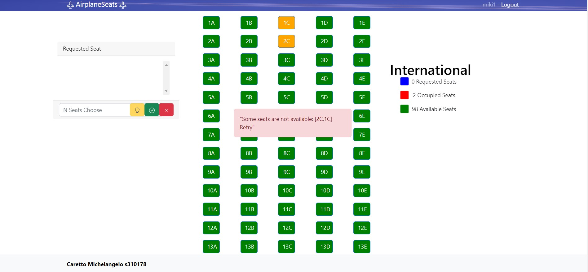

# Exam #12345: "AirplaneSeats"

## Student: s310178 Caretto Michelangelo

# Server side

## API Server

- POST `/api/login`
  - request
    - parameters: none
    - body content: json {username, password} of the user
  - response body content(Status 200):
    - json {id, name, email} about the authenticated user
- POST `/api/logout`
  - request
    - parameters: none
    - body content: none
  - response body content: none

- GET `/api/airplanes/`
  - request
    - parameters: none
    - body content: none
  - response body content(Status 200):
    - json [{id, name}], list of all airplanes

  (Retrieve the list of airplanes)
- GET `/api/airplanes/:airplanename`
  - request
    - parameters: airplanename
    - body content: none
  - response status: 
    - `200 OK` (success).
    - `500 Internal Server Error` (generic error). 
  - response body content(status 200): 
      - json {id, name}, about the specified airplane

(Retrive id and name by a given aiplane)

- GET `/api/planes/:airplanename/seats`
  - request
    - parameters: airplanename  name of the airplane for retriving his seats
    - body content: none
  - response status: 
    - `200 OK` (success).
    - `404 Not Found` (AirplaneNameNotFound).
    - `500 Internal Server Error` (generic error). 
  - response body content(Status 200): 
    - json [{id, type, seatCode,airplanename,userid: -1}]

 ( list of all seats by specified airplane, userId is set to -1 for Security Reason because this Api is accessible to all User)

## Logged Function

- GET `/api/planes/:airplanename/:user/seats`
  - request
    - parameters:
      -airplanename  name of the airplane for retriving his seats
      -user    id of the user to retrive his occupied seats
    - body content: none
  - Response status:  
    - `200 OK` (success).
    - `401 Unauthorized Access`
    - `404 Not Found` (AirplaneNameNotFound/UserNotFound). 
    - `500 Internal Server Error` (generic error). 
  - response body content(Status 200): 
    - json [{id, type, seatCode,airplanename,userid}]
                          
  (list of all occupied seats by an User for specified airplane)

                            
- PUT `/api/seats/edit`
  - request
    - parameters: none
    - body content:  json 

        
              - selectedSeats-list of seat to edit together,  
              - type-the new type to set,   
              - airplanename-the  airplane of the seats,
              - userid-the user id who want to modify seats
                
   - Response status: 
     - `200 OK` (success).  
     - `401 Unauthorized Access` 
     - `404 Not Found`(AirplaneNameNotFoundUserNotFound/    SeatsNotFound). 
     - `422 unprocessable entity` (Seat Already Occuped)
     - `500   Internal Server Error` (generic error).             
  - response body content:
    - Status(200): none
    - Status(422): 'Some seats are not available: [List of already occupied Seats]-Retry"

(Edit multiple seats with the s given type )
## Database Tables

- Table `users` - contains id, email, name, salt, password
- Table `airplanes` - contains id,name
- Table `seats` - contains id, type, seatCode, airplanename, userid

# Client side 

## React Client Application Routes

-  Route `/`: show the list of all  airplanes and allow user either logged or not  ,to navigate to the specified  airplane page 
- Route `/planes/:airplanename`: show the seats of the airplane having  airplanename equal to the parameter airplaname and allow logged users to  take 1 reservation of n seats  for each different airplane
- Any other routes: Airplane not found error

## Main React Components

- `MainLayout` (in `App.js`): define the main layout with the bar describing the website name and login/logout actions
- `LoginModal` (in `App.js`): component used in the main layout, define the form to perform login

- `AirplaneList` (in `AirplaneList.js`):Wrapper for PlanesGrid that retrieve the list of airplanes and user information if     logged and pass it to Planesgrid
- `PlanesGrid` (in `AirplaneList.js`): shows the airplanes grid and  button to route to the specified airplane

### AirplaneSeats 
- `AirplaneSeats` (in `AirplaneSeats.js`): It contains most of the logic of the application. It contains the most important state of the application which are passed throught props for rendering other components. 
1) **Main States:** 
- `plane`: A state contaning the information about the plane
- `seats`: A list of seats object
- `occupied`: A list of seats object  in this  plane that are occupied by the currently logged user .
- `errormsg`: Used to display several Error 
- `waiting`: State used for rendering purpouse  

2) **useEffect**
In this component there are several useEffect in order to fetch correctly the data needed for the application to work.
- The `first` useEffect retrieve the list of all seats of this airplane and if the user is logged retrieve his Reserversed seats too. This useEffect is triggered always when the `airplanename(params in the route) or user(user_Context)`  changes.
- The `second` useEffect send the error to CenteredAlert component that will be up for 5 second , and if the error corresponds to "Seats Already Occuped", it modify the seats state to making it highlight for 5 second  and after it fetch the uploaded data from db .This useEffect is triggered alway when the `errormsg state change` 
3) **Event Handler**
- `NSeatsChooseAlgorithm` Handle the N_ seat choose by choosing seats with an algorithm that take the first n free seats in the database and  upload `seats` state with this seats Requested.If a user already took any seats this algorithm find the remaning n seats . If a user want more seats than the Available set the errormsg state for displaying error,if a user wants fewer seats than he has already requested, the error is signaled too.
- `handleSeatClick` After  click on a seats it  upload the`seats state` with Occupied/Available
- `handleSeats` Call the api for creating/deleting a reservation and after it if there're no error fetch the uploaded data from db.If the api resolve that a user want  to take a reservation on an occupied seats the function change the `errormsg state`.

### Other Component  
- `SeatsList` (in `AirplaneSeats.js`): List the grid of  seats by plane, and if user is logged manage the click by calling     `props.handleSeatClick`. The colors of the seats in the non-authenticated version are Available green, occupied red, while those in the authenticated version are Available green, Occupied red, Highlight(error) orange, Requested blue .

- `Legend` (in `AirplaneSeats.js`): define the legend of the color and calculate the number using`props.seats` for each type(Occupied,Available(non-authenticated)-Occupied,Available,Requested(authenticated)) and show next to the legend.
- `Reservation` (in `AirplaneSeats.js`): Reservation form showed only if the user is logged. If the user dont' have a reservation in that plane, this component has the list that is updated when a seat is requested, and the possibility to use the n_choose algorithm, confirm/cancel(`props.handleSeats`) the reservation it using three different button. If the user already have a reservation the component show the list of the occupied seats by that user and a button for deleting that reservation(`props.handleSeats`).

- `CenteredAlert` (in `AirplaneSeats.js`): define the alert message in a fixed place

# Usage info

## Example Screenshot
 ## Planes Grid

 ## Local's Seats (not Authenticated)
 Show the Local's seats with 14 Occupied Seat and 46 Available

 ## Intercontinental's Seats- Requesting (Authenticated)
 User named miki requested 4 seats

 ## Intercontinental's Seats- Reservation Done (Authenticated)
 User named miki succesfully reserved  4 seats

 ## International's Seats- Failed Reservation(Authenticated)
 User named miki1 failed reservation because some seats were already occupied.

## Users Credentials

| User | Email | Password |Reservation|
|-----------|-----------|-----------|---------------------------|
| miki  | miki@gmail.com  | password  | 2 seats on  Local /2 seats on International|
| miki1  | miki1@gmail.com  | password  |  2 seats on International/ 2 seats on Intercontinental|
| miki2  | miki2@gmail.com  | password  | none|
| miki3  | miki3@gmail.com  | password  | none|